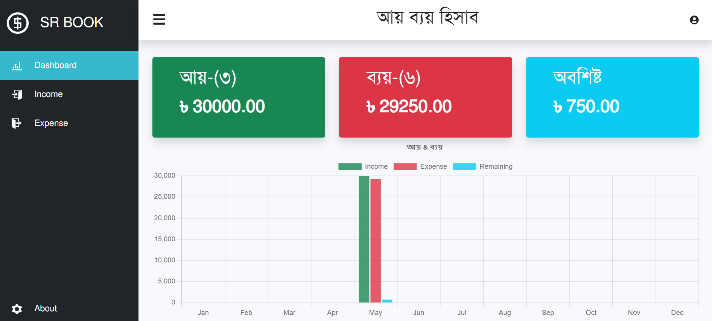

# Income Expense Tracker

## Demo
[https://code.wapborhan.com/income-expense-react/](https://code.wapborhan.com/income-expense-react/).

## Dashboard Screenshoot



## Income Screenshoot


## Expense Screenshoot


### Built with

- ReactJS
- Github API


### Installing

To run the Brand Shop project on your local machine, you need to have the following software installed:

- Nodejs
- Code Editor any (VS code recommended)

#### Steps

1. Clone the repository to your local machine:

```bash
  git clone https://github.com/wapborhan/github-users-react.git
```

You can do this by running the following command from the project directory:

```bash
   npm install
```

```bash
   npm start
```

Note: Need server site for run proper

### Features

- **Dashboard**: Show Total Income, Expanse and Remaining Balance
- **Income**: Add Income and show as tabular
- **Expanse**: Add Expanse and show as tabular


